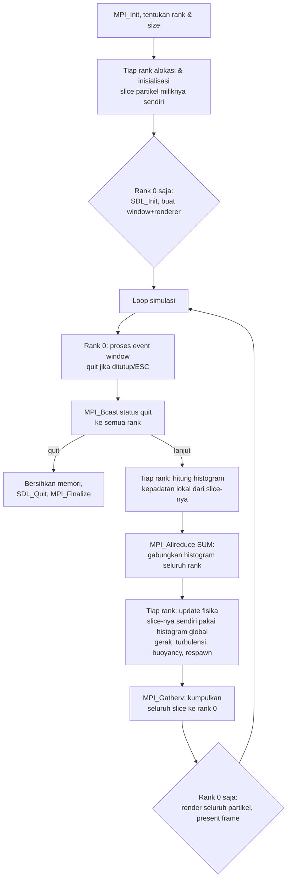

# Simulasi Particle System 2D — Efek Api (Fire Simulation)
Tugas Rancang — Praktikum Pemrosesan Paralel (CE 602)

## 1. Identitas
NAMA	: Natanael Kris Setyabudi	|| 
NIM	: 622023018

## 2. Deskripsi Singkat
Program ini adalah simulasi api 2D berbasis particle system dengan minimal 3000 partikel
aktif secara bersamaan. Aplikasi berbasis window (SDL2), bukan konsol, dan berjalan 
real-time (~60 FPS). Paralelisme diimplementasikan dengan **MPI** (Message Passing Interface).

## 3. Setup Development Environment
### 3.1 Dependensi
- Compiler C (gcc, sudah termasuk dalam paket build-essential)
- Implementasi MPI: **OpenMPI** atau **MPICH** (salah satu)
- **libsdl2-dev** (header + library SDL2 untuk grafis)

### 3.2 Instalasi (Ubuntu/Debian)
```bash
sudo apt-get update
sudo apt-get install -y build-essential libsdl2-dev
# pilih salah satu implementasi MPI:
sudo apt-get install -y openmpi-bin libopenmpi-dev
# ATAU
sudo apt-get install -y mpich libmpich-dev
```

### 3.3 Kompilasi
```bash
make
```
Perintah ini menjalankan:
```bash
mpicc -O2 -Wall -Wextra $(sdl2-config --cflags) main.c -o fire_sim $(sdl2-config --libs) -lm
```

### 3.4 Menjalankan
```bash
mpirun -np 4 ./fire_sim
```
- Ganti angka `4` dengan jumlah proses yang diinginkan.
- Tutup window atau tekan `ESC` untuk keluar.
- Argumen opsional: `mpirun -np 4 ./fire_sim 600` akan otomatis berhenti
  setelah 600 frame (dipakai untuk pengujian/benchmark otomatis tanpa
  perlu menutup window secara manual).
- Bisa juga memakai `make run NP=4`.

> Catatan: bila menjalankan di mesin dengan jumlah core fisik lebih kecil
> dari jumlah proses yang diminta, OpenMPI dapat menolak jalan kecuali
> ditambahkan flag `--oversubscribe` (lihat bagian pengujian).

## 4. Cara Kerja Program

Setiap partikel merepresentasikan satu titik api/bara dengan atribut:
posisi `(x, y)`, kecepatan `(vx, vy)`, dan sisa usia (`life`, mulai dari
nilai acak lalu berkurang setiap frame).

Alur tiap frame:
1. Partikel lahir di dekat dasar layar (area emitor), bergerak ke atas
   akibat gaya angkat (buoyancy) yang mensimulasikan panas.
2. Turbulensi horizontal (fungsi sinus + seed acak per partikel) membuat
   gerakan tidak seragam, menyerupai kobaran api yang bergoyang.
3. Semakin lama hidup, `life` berkurang → warna berubah dari
   putih → kuning → oranye → merah → asap gelap yang memudar (alpha turun).
4. Saat `life` habis atau partikel keluar dari atas layar, partikel
   **respawn** langsung di posisi baru di dasar emitor (sehingga jumlah
   partikel aktif selalu konstan 3000).
5. **Interaksi antar-partikel**: kepadatan partikel di tiap kolom grid
   horizontal dihitung setiap frame dan memengaruhi kekuatan buoyancy —
   area yang lebih padat partikel "mendorong" partikel lain naik lebih
   cepat, mensimulasikan efek kolom termal (mirip nyala api yang lebih
   besar/menyatu memiliki dorongan ke atas lebih kuat).
6. **Interaksi pengguna via mouse**: selama tombol kiri mouse ditahan,
   partikel dalam radius ±130 piksel dari kursor mendapat gaya tolak
   radial (menjauhi titik mouse), semakin kuat semakin dekat ke kursor,
   sehingga api tampak "tersibak" mengikuti posisi kursor.
7. **Pause/resume**: menekan tombol `SPASI` menghentikan seluruh update
   fisika (partikel diam persis di posisi terakhir, waktu simulasi ikut
   berhenti) sampai `SPASI` ditekan sekali lagi. Judul window menampilkan
   `[PAUSED]` sebagai indikator status.
8. **Kontrol intensitas api (`W` / `S`, ditahan)**: menahan tombol `W`
   menaikkan nilai `intensity` secara bertahap (api makin tinggi & makin
   besar, karena buoyancy, usia partikel, kecepatan luncur awal, dan
   ukuran render semuanya diskalakan oleh `intensity`); menahan `S`
   menurunkannya (api mengecil/melemah). Nilai `intensity` dibatasi pada
   rentang `[0.35, 2.20]` agar api tidak hilang total atau menjadi tak
   terkendali. Level intensitas saat ini ditampilkan di judul window dan
   sebagai bar indikator oranye di pojok kiri atas layar.

### Bagaimana kontrol mouse/keyboard tetap konsisten di semua proses MPI
Posisi mouse, status tombol kiri, status pause, dan level intensitas api
hanya diketahui rank 0 (satu-satunya proses yang membuka window). Setiap
frame, setelah membaca event dan status keyboard SDL, rank 0 mengirim
seluruh data ini dalam satu paket (`ControlState`: posisi mouse + 2 flag
+ nilai intensitas) ke seluruh rank lain lewat **satu kali `MPI_Bcast`**.
Dengan begitu, setiap rank yang mengerjakan slice partikelnya sendiri
tetap memakai posisi mouse, status pause, dan skala intensitas yang sama
persis pada frame yang sama.

## 5. Flowchart Program



## 6. Penjelasan Implementasi Paralel (MPI)

**Pembagian kerja (workload distribution):**
Total 3000 partikel dibagi rata ke seluruh proses MPI (`N/size`, sisa
dibagikan ke rank-rank pertama). **Setiap rank hanya menyimpan dan
mengupdate slice partikel miliknya sendiri** (bukan replikasi seluruh
array ke semua proses) — ini adalah pola *distributed memory* yang
sebenarnya, bukan sekadar paralelisasi loop di satu memori bersama.

**Collective operations yang dipakai tiap frame:**
| Operasi | Fungsi | Tujuan |
|---|---|---|
| `MPI_Bcast` | Sinkronisasi sinyal keluar (quit) | Semua rank berhenti serentak saat window ditutup |
| `MPI_Allreduce` (SUM) | Gabungkan histogram kepadatan 40-kolom dari tiap rank | Bentuk medan interaksi bersama (kolom termal) yang dipakai semua rank untuk update fisika partikelnya |
| `MPI_Gatherv` | Kumpulkan slice dari seluruh rank ke rank 0 | Rank 0 butuh data lengkap untuk digambar; `Gatherv` dipakai (bukan `Gather`) karena ukuran slice antar rank bisa berbeda saat `N_PARTICLES % size != 0` |

**Bagian yang benar-benar dieksekusi paralel:** perhitungan histogram lokal
dan update fisika (posisi, kecepatan, warna, respawn) — inilah proses
utama simulasi, dan keduanya dikerjakan hanya atas slice milik
masing-masing rank secara independen di antara dua titik komunikasi
(`Allreduce` dan `Gatherv`).

**Bagian yang sengaja tidak diparalelkan:** rendering (SDL) hanya berjalan
di rank 0, karena membuka banyak window grafis dari banyak proses tidak
relevan/tidak masuk akal untuk kasus ini; ini konsisten dengan praktik
umum program grafis+MPI (satu proses "master" untuk I/O/visual).

## 7. Hasil Pengujian

Pengujian fungsional dilakukan dengan menjalankan program hingga 300 frame
(mode `./fire_sim 300`, tanpa perlu menutup window secara manual) pada
1, 2, 4, dan 8 proses MPI, memakai `SDL_VIDEODRIVER=dummy` (tanpa layar
fisik) untuk memverifikasi program berjalan tanpa error/crash. Semua
kombinasi selesai dengan **exit code 0** dan tanpa error MPI.

Waktu komputasi rata-rata per frame (rata-rata dari seluruh rank), diukur
dengan `MPI_Wtime()`:

| Jumlah proses | Rata-rata waktu komputasi/frame | Rata-rata waktu komunikasi/frame |
|---------------|---------------------------------|----------------------------------|
|       1       |            2.1058 ms            | 		 0.1301 ms 	     |
|       2       |            1.0945 ms            | 		 0.2167 ms	     |
|       4       |            0.5978 ms 		  |		 0.2206 ms 	     |

**Pengamatan (apa adanya, tanpa dibuat-buat):**
- Waktu komputasi per rank menurun mendekati proporsional saat jumlah
  proses bertambah (pola yang diharapkan dari pembagian workload yang benar).
- Waktu komunikasi (`Allreduce` + `Gatherv`) justru **naik** seiring
  bertambahnya proses — wajar, karena overhead sinkronisasi antar proses
  bertambah, dan jumlah data per frame di sini relatif kecil (3000 partikel)
  sehingga overhead komunikasi mendominasi dibanding waktu hitungnya.
- **Keterbatasan pengujian ini**: sandbox tempat kode ini diverifikasi hanya
  memiliki **1 core CPU fisik** (`nproc` = 1), sehingga proses >1 dijalankan
  dengan `mpirun --oversubscribe` (banyak proses berbagi 1 core). Karena itu,
  angka speedup riil (wall-clock total, bukan waktu-per-rank) **tidak bisa
  diukur secara valid di lingkungan ini** — hasil di atas hanya membuktikan
  program *berjalan benar* dan *workload terbagi*, bukan bukti speedup nyata.
  
  Untuk laporan akhir, jalankan ulang benchmark ini (perintah persis di
  bawah) di komputer dengan CPU multi-core sungguhan dan laporkan
  wall-clock total (`time mpirun -np N ./fire_sim 600`) untuk N = 1, 2, 4
  agar didapat angka speedup yang benar-benar valid.

Perintah untuk mengulang pengujian ini:
```bash
SDL_VIDEODRIVER=dummy mpirun -np 1 ./fire_sim 300
SDL_VIDEODRIVER=dummy mpirun -np 2 ./fire_sim 300
SDL_VIDEODRIVER=dummy mpirun -np 4 ./fire_sim 300
```
Setiap run mencetak baris `[BENCHMARK] ...` di akhir berisi angka di atas.

**Pengecekan memori:** program juga dijalankan di bawah `valgrind
--leak-check=full`. Tidak ditemukan memory leak yang berasal dari kode
program ini sendiri (`main.c`) — leak yang terdeteksi valgrind seluruhnya
berasal dari internal library runtime OpenMPI/PMIx, sebuah temuan yang
umum dan terdokumentasi ketika menjalankan OpenMPI di bawah valgrind,
dan bukan bug pada program ini.

## 8. Dokumentasi Penggunaan

1. Kompilasi: `make`
2. Jalankan: `mpirun -np 4 ./fire_sim`
3. Sebuah window berjudul **"Simulasi Api - MPI Particle System"** berukuran
   800×600 akan terbuka, menampilkan efek api yang menyala dari bagian
   bawah tengah layar dan bergerak ke atas dengan warna berubah dari
   putih-kuning (paling panas) ke merah lalu asap gelap (paling dingin).
4. Tekan `ESC` atau tutup window untuk mengakhiri program dengan bersih
   (seluruh proses MPI ikut berhenti secara sinkron).
5. **Klik & tahan tombol kiri mouse** di atas nyala api: partikel di
   sekitar kursor akan menyingkir/tersibak menjauhi posisi mouse. Efek
   hilang begitu tombol dilepas.
6. Tekan **SPASI** untuk menjeda simulasi (partikel membeku di posisi
   terakhir, judul window berubah jadi `[PAUSED]`); tekan **SPASI** lagi
   untuk melanjutkan.
7. **Tahan tombol `W`** untuk membesarkan api (lebih tinggi & lebih
   besar); **tahan tombol `S`** untuk mengecilkannya. Lepas tombol untuk
   mempertahankan level intensitas saat itu. Level saat ini terlihat di
   judul window dan di bar indikator oranye pojok kiri atas.
8. Untuk menyesuaikan jumlah proses paralel: ganti angka setelah `-np`.
   Menambah proses tidak mengubah jumlah partikel (tetap 3000), hanya
   mengubah berapa banyak partikel yang dihitung oleh tiap proses.

### Parameter yang bisa diubah di `main.c`
| Konstanta | Efek |
|---|---|
| `N_PARTICLES` | Jumlah total partikel aktif |
| `GRID_COLS` | Resolusi histogram kepadatan (interaksi antar partikel) |
| `BASE_BUOYANCY`, `DENSITY_BUOYANCY_GAIN` | Kekuatan dorongan ke atas |
| `TURBULENCE_STRENGTH` | Seberapa liar goyangan api |
| `LIFE_MIN`, `LIFE_MAX` | Rentang usia partikel (durasi nyala) |
| `MOUSE_REPEL_RADIUS` | Jangkauan pengaruh klik mouse (piksel) |
| `MOUSE_REPEL_STRENGTH` | Seberapa kuat api tersibak menjauhi kursor |
| `FIRE_INTENSITY_MIN`, `FIRE_INTENSITY_MAX` | Batas bawah/atas skala besar-kecil api (`W`/`S`) |
| `FIRE_INTENSITY_RATE` | Seberapa cepat intensitas berubah saat `W`/`S` ditahan |

## 9. Struktur Proyek
```
fire_mpi/
├── main.c        # source code utama (MPI + SDL2)
├── Makefile      # perintah build & run
└── README.md     # dokumentasi ini
```
